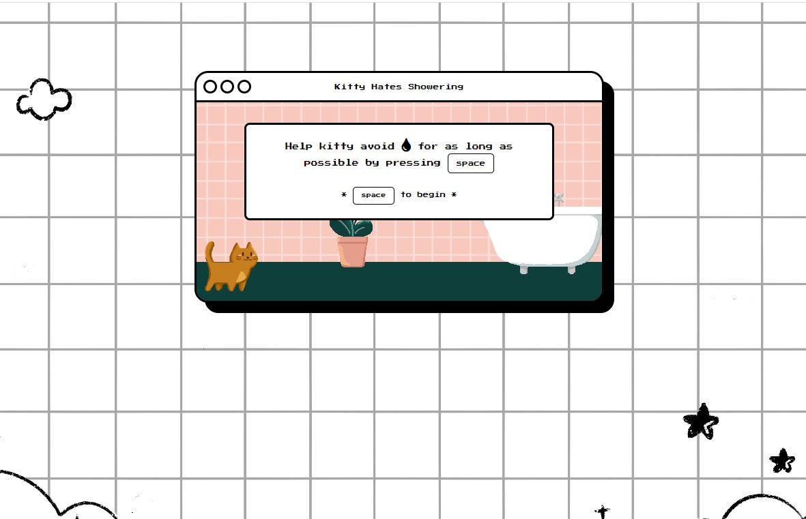

# GA Software Engineering Immersive Project 1 - Escape the Showering Hell

This game was created as a challenge for myself to replicate Google Chrome's well known Dinosaur Game and took inspiration from the fact that most cats do not like showering. You can try the game over [here](https://charmainelhm.github.io/meow-hurdle/)!

## Overview

### How It Works

As the game begins a series of water droplets will head Kitty's way. Kitty will need to avoid those water droplets by hitting the spacebar. Game ends when any of the water droplets touches Kitty. The difficulty level of the game will increase progressively, mean that the longer the player is in the game, the harder the game will become.

## My process

### Built with

- Vanilla CSS and Javascript
- Flexbox
- CSS Grid

### Continued development

These are the few things I would like to work on moving forward:

- Making the game playable on mobile
- Setting up a highscore board for the game

## Author

Developed and illustrations done by: Charmaine Lee

- [Website](https://charmainelhm.netlify.app/)
- [LinkedIn](https://www.linkedin.com/in/charmainelhm/)
